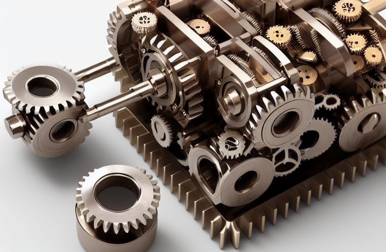
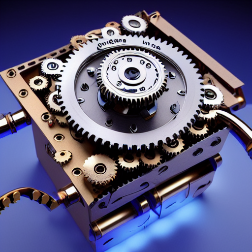
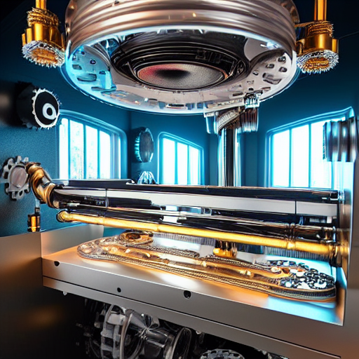
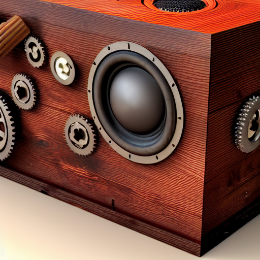

# Appendix

### Risk Assesmsent for WIP Show&#x20;

<figure><figcaption></figcaption></figure>

<figure><figcaption>
<strong>3D render of a science fiction mechanical device with ((gears)), mechanisms, high detail, metallic colours, octane render, high definition, very detailed, (((cube structure)))</strong>
</figcaption></figure>

<figure><figcaption>
<strong>3D render of a science fiction mechanical device with (gears), ((dials)), ((levers)), ((belts)), LED Lights, mechanisms, high detail, metallic colours, octane render, high definition, very detailed, ((cube structure)),</strong>
</figcaption></figure>

<figure><figcaption>
<strong>3D render of a science fiction mechanical device that prints photographs, [gears], ((dials)), ((levers)), ((belts)), LED Lights, mechanisms, high detail, metallic colours, octane render, high definition, very detailed, ((geometric structure)), ((in the style of Sebastien Hue))</strong>
</figcaption></figure>

<figure><figcaption>
<strong>A 3D render of a wooden box with mechanical features, ((microphones)), ((speakers)), ((levers)), ((dials)), (((gears))), (industrial belts) (LED Lights), mechanisms, high detail, metallic colours:0.10 varnished wood:0.9 hybrid, octane render, high definition, very detailed, ((geometric structure)), Wood Panelled Room Background, (cube structure)</strong>
</figcaption></figure>

