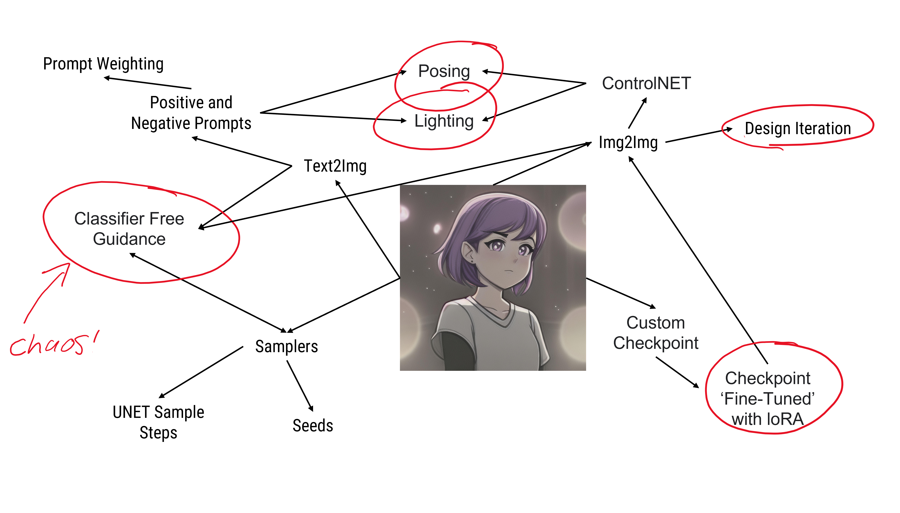

# Physical Interface

<figure><figcaption></figcaption></figure>

<figure><figcaption></figcaption></figure>

This interface will focus on giving some of the Stable Diffusions functions a physical interface.&#x20;

<figure><figcaption></figcaption></figure>
