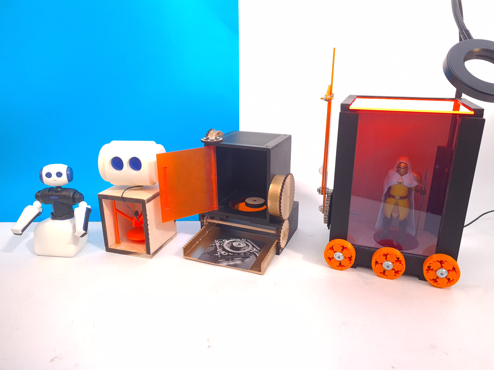
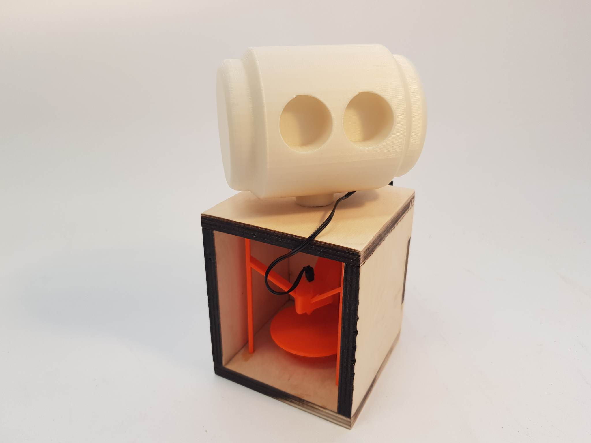
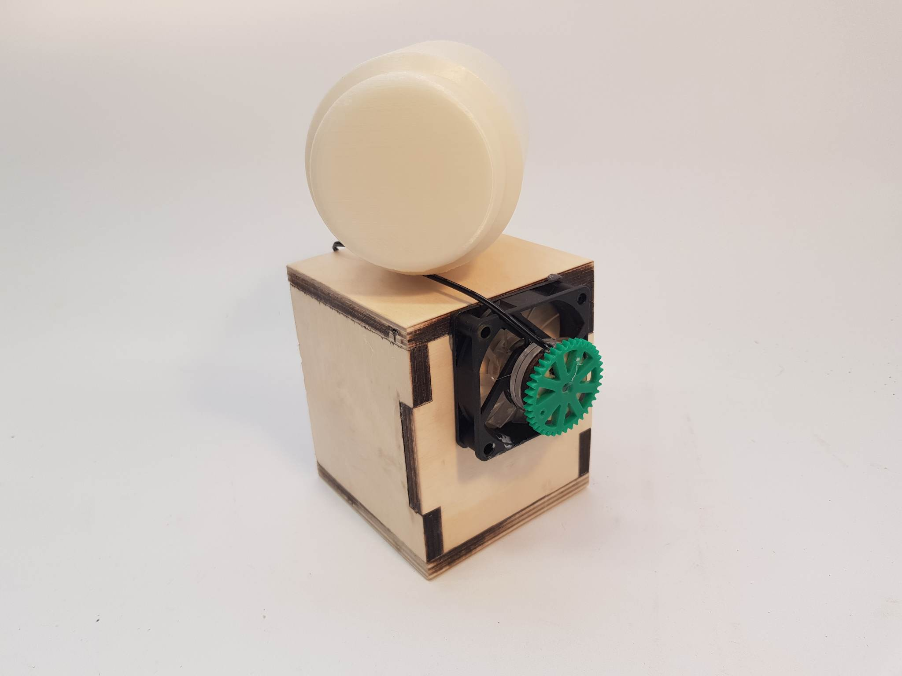
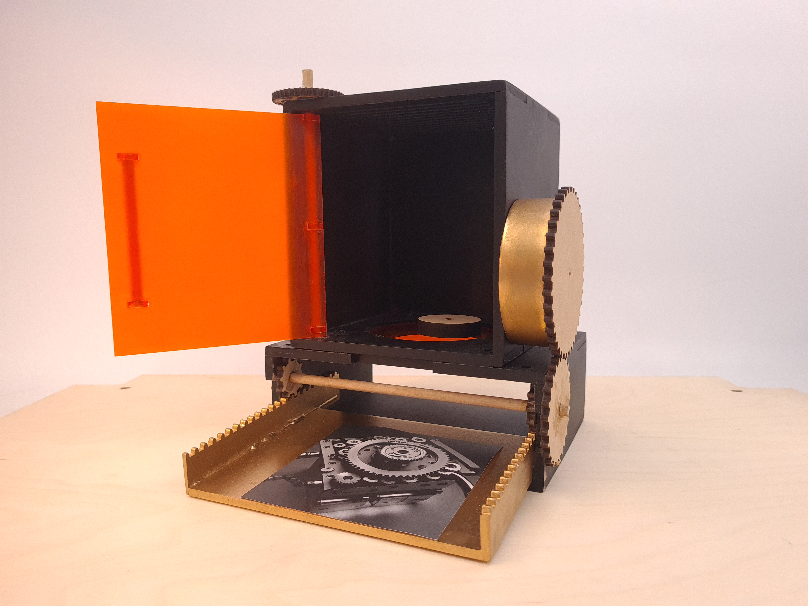
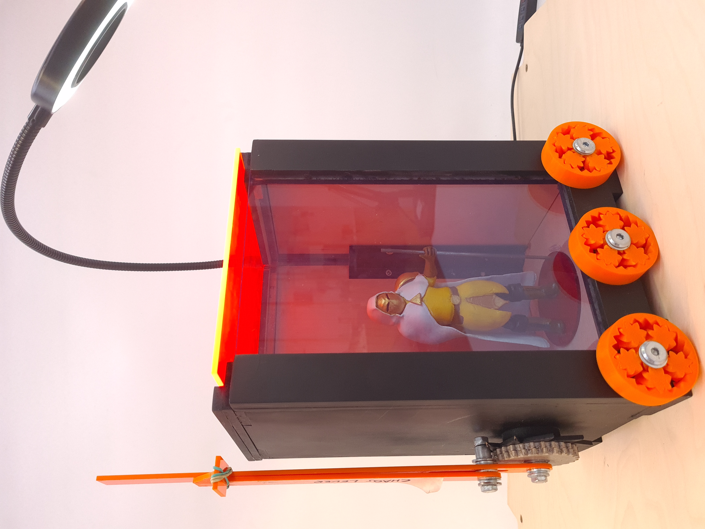

# Physical Prototyping

<figure><figcaption></figcaption></figure>

## Sketches aimed at making physical protypes

<figure><figcaption></figcaption></figure>

<figure><figcaption></figcaption></figure>

<figure><figcaption></figcaption></figure>

<figure><figcaption></figcaption></figure>

## Finished Product Sketches&#x20;

## Therapy 3D Printer

<figure><figcaption></figcaption></figure>

 

<figure><figcaption></figcaption></figure>

Imagine coming home from a stressful day as an accountant, and discussing it with your Therapy 3D printer. It takes this information, your deepest woes, and prints an object to solve your problem, make you feel better, or just take the edge off!&#x20;

## Literal Black Box MK 1

<figure><figcaption></figcaption></figure>

### Literal Black Box MK2

<figure><figcaption></figcaption></figure>

