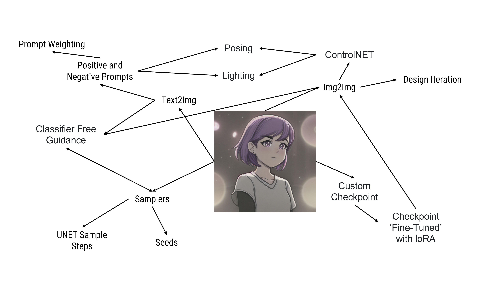

# The AI Design Workflow and Stable Diffusion Functions

## Stable Diffusion: Prompt Engineering and Features

<figure><figcaption></figcaption></figure>

**Positive Prompts:** photograph, A science fiction ((toaster)), slices of toast, plate, inside an old house, The light from the side illuminates dust in air and refraction at it's end, by Greg Rutkowski, UHD 8mm f/4 lens nikon, zbrush, photo realistic, detailed hyperrealism, very dramatic lighting

This prompt gives a nice and semi-coherent image on it's own, but offers the designer no real control over the output. All ten images are from same prompt.&#x20;

<figure><figcaption></figcaption></figure>

 

<figure><figcaption></figcaption></figure>

 

<figure><figcaption></figcaption></figure>

 

<figure><figcaption></figcaption></figure>

 

<figure><figcaption></figcaption></figure>

 

<figure><figcaption></figcaption></figure>

 

<figure><figcaption></figcaption></figure>

 

<figure><figcaption></figcaption></figure>

 

<figure><figcaption></figcaption></figure>

 

<figure><figcaption></figcaption></figure>

### Prompt Engineering

<figure><figcaption></figcaption></figure>

**The use of negative prompts and prompt weighting helps the designer assert more control over the design generations and ensures consistency among most generations.**&#x20;

**Positive Prompts:** ((photograph)), \[A science fiction] ((toaster)), (slices of toast inside toaster), inside an old house, objects sat on top of wooden table. (shiny silver metallic:0.75 blue LED:0.25 hybrid), metallic finish, ((The light from the side)), (by Greg Rutkowski), UHD 8mm f/4 lens nikon, zbrush, photo realistic, detailed hyperrealism, very dramatic lighting, (lens flare)

**Negative Prompts:** Mechanical man, (human), (human figure), (human face), man, woman, child, pots, pans, kitchenware, plants, dull colours, ((multiple objects)), ((bad shapes)), multiple windows, stool, chair, seat, watermark, artist signature

<figure><figcaption></figcaption></figure>

 

<figure><figcaption></figcaption></figure>

 

<figure><figcaption></figcaption></figure>

 

<figure><figcaption></figcaption></figure>

 

<figure><figcaption></figcaption></figure>

 

<figure><figcaption></figcaption></figure>

 

<figure><figcaption></figcaption></figure>

 

<figure><figcaption></figcaption></figure>

### Feature Map

Stable Diffusion allows for users to exert massive control over images, using far more than just simple text input.&#x20;

This character art was created using all of these different features

<figure><figcaption></figcaption></figure>

## Improving  the interface of AI

### Narrowing the focus of the project

<figure><figcaption></figcaption></figure>

## Controlling the lighting

<figure><figcaption></figcaption></figure>

 

<figure><figcaption></figcaption></figure>

<figure><figcaption></figcaption></figure>

## The functions of Stable Diffusion (Image-to-image) and how to translate them into the physical

Positive Text prompts - **Sing about the things you want**

Negative text prompts - **Sing about the things that you do not want (talking does nothing)**

Image Uploading - **either place a 3D object into the box, or slide a printed image in through a slot.**&#x20;

Width and height - **expandable frame thingy**

Classifier Free Guidance - **How much the generation sticks to the given text prompt.**

Seed - a pot that you put marbles or seeds into.&#x20;

Denoising Strength - **IT'S LEVER TIME!**

Batch size and Batch count - **Microwave like setting?**

Sampling Method - **Differences shown through different images on a wheel**

**Model Training - Put a load of object in the box!**&#x20;

## **The complete lack of feedback from Sable Diffusion**

**Pain Points**&#x20;

* Which version of Python needs to be used?&#x20;
* when automatically renaming, a .png and .jpg will both be named the same
* You do not have CUDA.... THE FUCK IS CUDA?&#x20;
* Do I have the minimum system requirements?&#x20;
* I am not an artist, but I make AI Art. WHAT QUALIFIES AS GOOD ART?&#x20;
  * Accurtate light sources
  * good anatomy,
  * colour theory.&#x20;
* Why does it keep generating cars despite negative prompts. Is it model? is it the sampler?&#x20;
* How to best engineer a prompt. Does order matter. How much detail is needed?&#x20;
  * Suggest prompts based on desired outcome?
* What is the difference between all the upscaling methods?&#x20;

## TRAINING STABLE DIFFUSION TO DO CHARACTER DESIGN

Make a LoRA using Hero forge screenshots&#x20;

