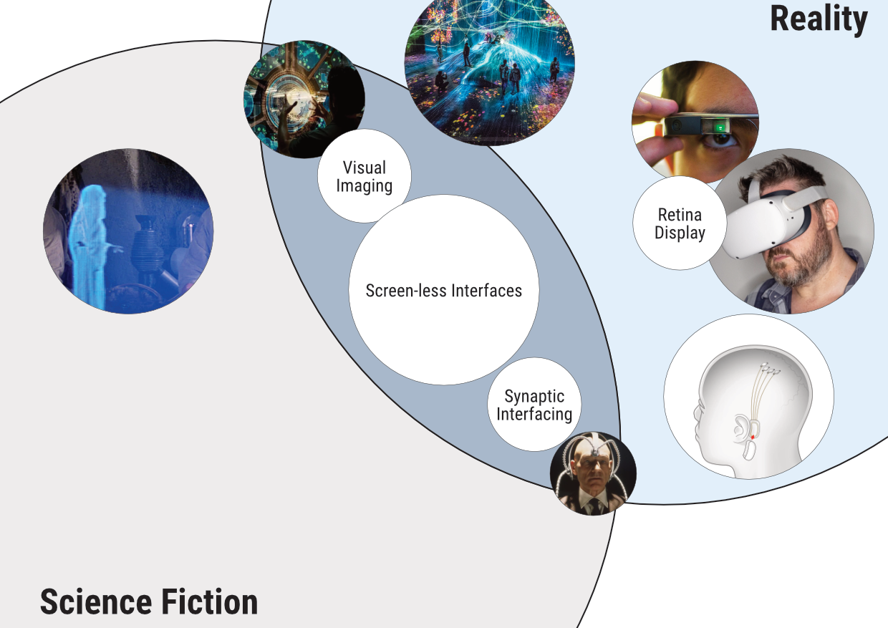

# Ways to interface with Technology

<figure><figcaption></figcaption></figure>

### The three main types of Screen-less Interface (Shinde, 2016)

Visual Imaging - light is projected into the environment without a screen to be picked up by the eye

Retina Display - light is projected directly onto the users retina

Synaptic Interfacing or direct neural interfacing - visual information is delivered directly to the brain, bypassing the eyes completely and there is no light involved.&#x20;

### Examples of Screen-less Technology

Holograms and Holography (Visual Imaging)

Google Glass (Retina Display)

**BatBand** - Synaptic Interfacing



**Fighter Jet Heads Up Displays -** Visual Imaging

**Neuralink -** Synaptic Interfacing&#x20;

**"non-intrusive helmet-like devices (technically known as ‘transcranial direct current stimulators’)**" (Harari, Yuval Noah. 2018. _Homo Deus: A Brief History of Tomorrow_. p233)

Shinde, Pradnya, and Ashwini kharat. 2016. “SCREENLESS DISPLAY-THE REALITY OF FUTURE.” _VESCOMM-2016_, February.

## Visual Imaging - Holograms





### Generating 3D models automatically



<figure><figcaption></figcaption></figure>

## Product Photography - Lighting

### Elements of Product Photography



* Lighting
* Reflection,&#x20;
* Distortion
* Focus
* Framing and composition

### Home Style Studio

<figure><figcaption></figcaption></figure>

 

<figure><figcaption></figcaption></figure>

### Photo Studio with controlled lighting

<figure><figcaption></figcaption></figure>

 

<figure><figcaption></figcaption></figure>

### Natural scenery&#x20;

<figure><figcaption></figcaption></figure>

 

<figure><figcaption></figcaption></figure>

### Home Photo Boxes for warhammer Mini's&#x20;

{% embed url="https://www.amazon.com/PULUZ-Shooting-Portable-Photography-Backgrounds/dp/B08RS75LVQ/ref=sr_1_5?keywords=Photo%2Bstudio%2Bbox&sr=8-5&th=1" %}

<figure><figcaption></figcaption></figure>

 

<figure><figcaption></figcaption></figure>

### The Volume - Cutting Edge Industry&#x20;



<figure><figcaption>
Source: <a href="https://www.comingsoon.net/movies/features/1225599-the-volume-star-wars-revolutionary">https://www.comingsoon.net/movies/features/1225599-the-volume-star-wars-revolutionary</a>
</figcaption></figure>

## Connecting this to Stable Diffusion

